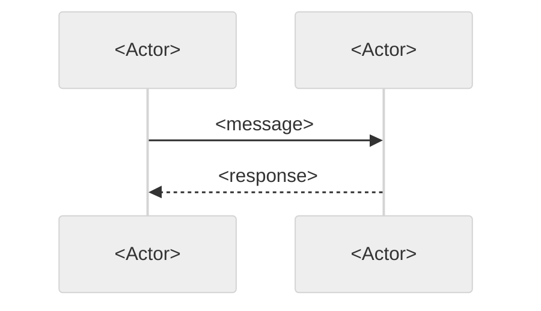
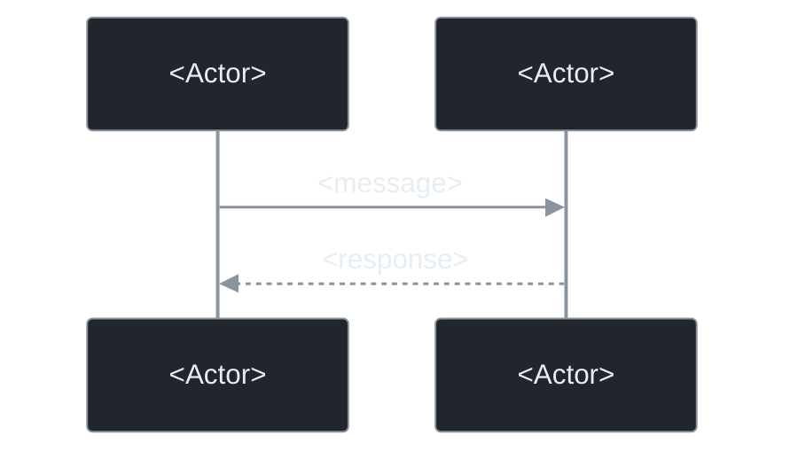

# Greptile-Style Output

Use one review body plus self-contained inline findings. Preserve the recognizable summary,
confidence score and important-files table without padding the report or claiming this is an
actual Greptile service review. Adapt to any explicit user-requested format.

## Review body

For a re-review, first include **Since last review**: each prior finding's link, status, and
verification evidence. Include **Recorded decisions** only when decisions exist; attribute the
choice and explain its scope without implying the reviewer accepted residual risk.

Then use this shape:

````markdown
<details><summary><h3>Greptile Summary</h3></summary>

<Brief description of the changed behavior and overall result.>

- <Key behavior or interaction worth understanding.>
</details>

### Confidence Score: N/5

<Verdict and supporting evidence. This rates merge confidence in the reviewed scope.>

Reviewed: `<head SHA>` against `<base SHA / merge-base>`, or an explicit local scope.
Verification: <tests/commands actually run and result, or "static review only">.
Coverage: <material omissions, unavailable context, or partial review>.

<Optional files worth another look, tied to specific uncertainty.>

<details><summary><h3>Important Files Changed</h3></summary>

| Filename | Review observation |
| --- | --- |
| path/to/file | Relevant behavior, interaction, or risk with supporting evidence. |
</details>
````

Keep the table to significant files actually reviewed. Omit boilerplate bullets and optional
sections when empty. Findings that cannot be anchored go in a **Findings** section in the body;
questions and unresolved choices go in a separate **Open questions / decisions** section.
Never describe an unverified file as correct or turn an open question into a defect badge.

### Score calibration

- **5:** strong evidence supports merging the reviewed change; relevant paths were reviewed and
  meaningful verification succeeded, with no material unresolved concern.
- **4:** no actionable defect found, with ordinary residual uncertainty or minor nonblocking issues.
- **3:** material coverage gaps or unresolved P2 defects need attention before confident sign-off.
- **2:** demonstrated P1 defects or major verification limits prevent a merge recommendation.
- **1:** demonstrated P0 failure makes merging unsafe.

P0 caps the score at 1; P1 at 2; unresolved P2 at 3. Coverage can lower the score independently
of severity. If there is too little source to assess, use **Not assessed** instead of inventing
a number. "No actionable findings in the reviewed scope" is more accurate than an unconditional
"safe to merge". State limitations even when the score is high.

## Inline findings

```markdown
<a href="#"></a> **Preserve the tenant filter when loading invoices**

When <supported trigger>, <changed code> causes <concrete failure>. <Caller or contract at
`path:line` establishes why this input reaches the code and what breaks>. **Fix:** <specific
correction, or the invariant the fix must preserve>.
```

Each comment must stand alone without references to "the summary above" or another finding.
Use a short action-oriented title, a precise anchor, and enough evidence to reproduce the
reasoning. Include sibling comparisons only when they establish the contract or failure.
A conceptual fix is enough; do not prescribe an unverified patch.

Badge URLs (keep matching alt text so images degrade to text):

- P0: `https://img.shields.io/badge/P0-blocker-d1242f`
- P1: `https://img.shields.io/badge/P1-high-bc4c00`
- P2: `https://img.shields.io/badge/P2-medium-bf8700`
- P3: `https://img.shields.io/badge/P3-low-57606a`

Use the priorities and exclusions in [review-rubric.md](review-rubric.md). Do not duplicate
still-open inline threads or suppress valid findings just to reach a desired comment count.

## Closing re-review

When SKILL.md's convergence requirements are satisfied, use a short ledger with verification
links, any recorded decisions, and a handoff sentence. No new inline comments or diagram are
needed. Choose APPROVE only when the convergence, coverage and event conditions in SKILL.md
permit it; otherwise COMMENT and state what still requires human sign-off.

## Optional sequence diagram

Include only when it clarifies a consequential multi-step interaction. Diagram observed
behavior, not an imagined intended implementation. Skip it for mechanical changes.

## Dual-theme mermaid template` below so it renders on both GitHub themes.

## Inline comments — `P`-level findings

Each comment opens with an SVG priority **badge** (an HTML ``, not a text prefix),
followed by a bold one-line title with code symbols in backticks, then the explanation
paragraph(s). Badges are our own, generated by shields.io — never hotlink Greptile's assets.
Exact markup:

````markdown
<a href="#"></a> **`<symbol>` <short title in plain words>**

<What's wrong, in terms of the cross-file reality. Contrast with the established sibling
pattern when one exists ("Contrast this with `X`, which …"). State the downstream consequence
— what breaks, or what false confidence it creates. Then the fix, concretely.>
```

Badge URL per priority (always with matching `alt="P0"` etc. so it degrades to text if the
image is blocked):

- **P0** — `https://img.shields.io/badge/P0-blocker-d1242f`
- **P1** — `https://img.shields.io/badge/P1-high-bc4c00`
- **P2** — `https://img.shields.io/badge/P2-medium-bf8700`
- **P3** — `https://img.shields.io/badge/P3-low-57606a`

In the **terminal fallback**, render the badge as a plain `P1` prefix instead of the ``.

Worked example (the canonical shape — sibling-pattern contrast + false-confidence consequence):

```markdown
<a href="#"></a> **`$withDrafts` accepted but silently ignored**

`ArrayJourneyRepository.find()` stores every journey added via `withJourneys()` in a single flat
map and returns it regardless of the `$withDrafts` flag. Contrast this with
`ArrayProductRepository`, which maintains separate `$products` and `$draftProducts` collections
and gates access based on the flag. Because of this gap, `GetJourneyControllerTest` has no test
equivalent to `GetProductControllerTest::it_returns_404_for_a_draft_product_without_the_preview_ability`
— any test that places a draft journey via `withJourneys()` and then calls the endpoint without
the preview ability will still receive a 200 response from the fake, giving false confidence that
the gating works at the controller layer.
```

Priority scale (see `review-rubric.md` for full definitions): **P0** must-fix blocker
(broken/insecure/data loss), **P1** high — likely defect or a gap that gives false confidence,
**P2** medium — fragile/edge case/missing test, **P3** low — minor improvement. Suppress P3
unless asked or nothing higher exists.

The best comments name the **sibling pattern** the change diverges from and the **second-order
consequence** (e.g. "a fake that ignores the flag means the controller-layer gating test passes
for the wrong reason"). That cross-file reasoning is the whole point — a finding that only reads
the changed line is a lint, not a Greptile review.

Each comment must be **self-contained**: the author reads it as a lone thread in the GitHub UI,
without the review body beside it. Never reference "the summary above", "as noted in another
comment", or numbering from the review body.

## Re-review variant

When prior rounds exist (SKILL.md step 2), the body opens with a resolution ledger **before**
the Greptile Summary:

```markdown
### Since last review

- ✓ **<finding title>** — fixed in `<commit>` (verified)
- ▣ **<finding title>** — decision recorded: <one-line policy>
- ○ **<finding title>** — still open
```

Follow with a **Recorded decisions** list — one bullet per settled decision, stated as accepted
policy, not as a concern — then the remaining sections. New inline comments only for findings
anchored in new commits or explicitly flagged as previously missed in unchanged code.

## Closing review (converged)

When the ledger shows every entry fixed or decision-settled and there are no new findings, the
review is short: the ledger, the Recorded decisions list, and one handoff line — e.g. "All
implementation findings are resolved; the remaining items were decisions and are recorded
above. Recommend human sign-off on the recorded decisions." No inline comments, no new
P-badges, no sequence diagram. Event: `APPROVE`.

## Event selection

Any `P0` → `REQUEST_CHANGES`. Converged re-review (closing review) → `APPROVE`. Otherwise
`COMMENT` (Greptile defaults to comment-only even with P1/P2 present, pairing them with the
confidence score). Only request changes for a genuine blocker.

## Dual-theme mermaid template

Use the existing dual-theme presentation for GitHub reports. Keep both copies identical in
behavior; only the styling differs. If the target renderer cannot support this wrapper, use
a single native Mermaid block. The light copy uses `neutral`; the dark copy sets theme variables.

```markdown
<details><summary><h3>Sequence Diagram</h3></summary>

<a href="#gh-light-mode-only">



</a>
<a href="#gh-dark-mode-only">



</a>
</details>
````


## Local report or posting fallback

Return plain Markdown in the conversation. Lead with findings:

`P<n> path:line — Title. Trigger, failure, evidence. Fix: correction.`

Then give the concise summary, reviewed scope, verification, and limitations. Use clickable
local file links where supported. Skip HTML badges and collapsible wrappers. If delivery failed
or is uncertain, say so explicitly; never imply a local report was posted to GitHub.
